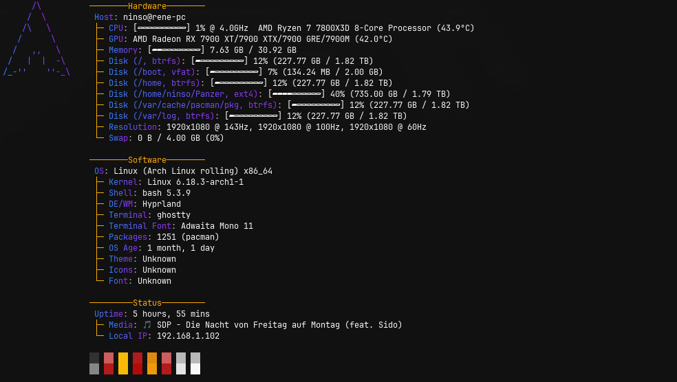

<p align="center">
  <h1 align="center">NovaFetch</h1>
  <p align="center">
    <strong>Fast, customizable, rice-ready system fetch tool written in Rust</strong>
  </p>
  <p align="center">
    <a href="https://www.rust-lang.org/"></a>
    <a href="LICENSE"></a>
    
  </p>
</p>

---



NovaFetch is a lightning-fast system information tool designed for Linux enthusiasts and ricers. It features a unique **tree-structured layout** that organizes system information into logical categories (Hardware, Software, Status), making your terminal output both informative and aesthetically pleasing.

---

## Key Features

### Hierarchical Tree Layout
Information is automatically grouped into three categories with box-drawing characters:
- **Hardware** — Host, CPU, GPU, Memory, Disk, Resolution, Swap
- **Software** — OS, Kernel, DE/WM, Shell, Terminal, Packages, Theme, OS Age  
- **Status** — Uptime, Local IP, Media (Now Playing)

```
────────Hardware────────
 Host: user@hostname
 ├─ CPU: [▰▰▰▱▱▱▱▱] 15% @ 4.0GHz  AMD Ryzen 7 (43.9°C)
 ├─ GPU: AMD Radeon RX 7900 (42.0°C)
 └─ Memory: [▰▰▰▱▱▱▱▱] 7.63 GB / 30.92 GB

────────Software────────
 OS: Linux (Arch Linux rolling) x86_64
 ├─ Kernel: Linux 6.18.3-arch1-1
 ├─ Shell: bash 5.3.9
 └─ Packages: 1251 (pacman)
```

### Visual Progress Bars
Four switchable bar styles for CPU, Memory, and Disk usage:
| Style | Appearance |
|-------|------------|
| **Classic** | `[████░░░░]` |
| **Round** | `[▰▰▰▱▱▱]` |
| **Retro** | `[####....]` |
| **Minimal** | `●●●○○○` |

### Rich System Information
| Module | Description |
|--------|-------------|
| `user_host` | Username and hostname |
| `os` | Distribution name and architecture |
| `kernel` | Kernel version |
| `uptime` | System uptime |
| `shell` | Current shell and version |
| `de` | Desktop Environment / Window Manager |
| `cpu` | Model, frequency, usage %, temperature |
| `gpu` | Model and temperature (AMD/NVIDIA/Intel) |
| `memory` | Used/Total RAM with optional temperature |
| `disk` | Usage per mount point (multiple disks supported) |
| `swap` | Swap usage |
| `terminal` | Terminal emulator name |
| `terminal_font` | Terminal font |
| `packages` | Package count (pacman, apt, dnf, etc.) |
| `resolution` | Display resolution(s) |
| `os_age` | System installation age |
| `theme` | GTK Theme, Icons, Font |
| `media` | Currently playing track (MPRIS) |
| `local_ip` | Local IPv4 address |
| `palette` | ANSI color palette (16 colors) |

### Theming & Colors
- **RGB Gradient Labels** — Smooth color transitions from primary to secondary color
- **Solid Color Mode** — Single color for labels
- **Customizable Colors** — Full RGB control via config
- **Nerd Fonts Support** — Optional icons for each module

### ASCII Art & Images
- **30+ Distribution Logos** — Auto-detected or manually overridden
- **Image Support** — Use custom PNG/JPG/GIF images as logos
- **Side-by-Side Layout** — Logo and info displayed together with proper alignment

### Output Formats
- **Terminal** — Colored, formatted output (default)
- **JSON** — Machine-readable output for scripting (`--json`)
- **No Color** — Plain text mode (`--no-color`)

---

## Installation

### Prerequisites
- [Rust](https://www.rust-lang.org/) 1.70+ and Cargo (via [rustup](https://rustup.rs/))

### Build from Source

```bash
git clone https://github.com/yourusername/novafetch.git
cd novafetch
cargo build --release
```

### Install to PATH

```bash
cargo install --path .
```

The binary is installed to `~/.cargo/bin/novafetch`.

### Run

```bash
# After installation
novafetch

# Or run directly from build
./target/release/novafetch
```

---

## Usage

```
novafetch [OPTIONS]

Options:
      --logo <NAME>     Override ASCII art logo (e.g., arch, ubuntu, fedora)
      --no-color        Disable colored output
      --config <PATH>   Path to config file
      --json            Output system info as JSON
  -h, --help            Print help
```

### Examples

```bash
# Use Arch Linux logo regardless of detected distro
novafetch --logo arch

# Output JSON for scripting
novafetch --json | jq '.Memory'

# Use a custom config file
novafetch --config ~/my-config.toml

# Plain text output (no colors)
novafetch --no-color
```

---

## Configuration

NovaFetch uses a TOML configuration file. On first run, a default config is automatically created at:

```
~/.config/novafetch/config.toml
```

### Full Configuration Reference

```toml
[general]
separator = "  "           # Separator between label and value
use_nerd_fonts = true      # Show Nerd Font icons
align_values = true        # Align values vertically
unit_type = "standard"     # Byte units: "standard" | "iec" | "si"
show_memory_bar = true     # Show progress bar for memory
show_cpu_bar = true        # Show progress bar for CPU
show_disk_bar = true       # Show progress bar for disk
# image_path = "/path/to/image.png"  # Custom logo image
# image_width = 36                    # Image width in characters

[theme]
# RGB colors [R, G, B]
primary_color = [59, 130, 246]     # Blue - gradient start / solid labels
secondary_color = [147, 51, 234]   # Purple - gradient end
text_color = [255, 255, 255]       # White - values
mode = "gradient"                   # "gradient" or "solid"

[ascii]
print_ascii = true         # Show ASCII/image logo
distro_override = null     # Force logo: "arch", "ubuntu", "fedora", etc.

# Module order and selection - only listed modules are shown
layout = [
    "user_host",
    "os",
    "kernel",
    "uptime",
    "shell",
    "de",
    "cpu",
    "gpu",
    "memory",
    "disk",
    "terminal",
    "terminal_font",
    "packages",
    "resolution",
    "swap",
    "os_age",
    "theme",
    "media",
    "local_ip",
    "palette"
]
```

### Customizing the Layout

Remove or reorder entries in the `layout` array to customize what information is displayed:

```toml
# Minimal layout example
layout = [
    "user_host",
    "os",
    "cpu",
    "memory",
    "palette"
]
```

### Changing Bar Style

Edit `src/info/bar.rs` and change the `CURRENT_BAR_STYLE` constant:

```rust
pub const CURRENT_BAR_STYLE: BarStyle = BarStyle::Classic;  // or Round, Retro, Minimal
```

Then rebuild: `cargo build --release`

---

## Supported Distributions

NovaFetch includes ASCII art for 30+ Linux distributions:

| Distribution | Slug |
|--------------|------|
| Arch Linux | `arch` |
| Debian | `debian` |
| Ubuntu | `ubuntu` |
| Fedora | `fedora` |
| openSUSE | `opensuse` |
| Gentoo | `gentoo` |
| Linux Mint | `mint` |
| Manjaro | `manjaro` |
| EndeavourOS | `endeavouros` |
| Pop!_OS | `popos` |
| Kali Linux | `kali` |
| Alpine | `alpine` |
| NixOS | `nixos` |
| Void Linux | `void` |
| Artix | `artix` |
| Garuda | `garuda` |
| Rocky Linux | `rocky` |
| AlmaLinux | `alma` |
| macOS | `macos` |
| Windows | `windows` |
| *...and more* | |

Use `--logo <slug>` to override auto-detection.

---

## Dependencies

NovaFetch is built with carefully selected Rust crates:

| Crate | Purpose |
|-------|---------|
| `sysinfo` | CPU, Memory, Disk, Process information |
| `clap` | Command-line argument parsing |
| `serde` + `toml` | Configuration file handling |
| `colored` | Terminal color output |
| `chrono` | Time and date formatting |
| `mpris` | Media player information (D-Bus) |
| `local-ip-address` | Network interface detection |
| `display-info` | Screen resolution |
| `viuer` + `image` | Image rendering in terminal |
| `whoami` | User and hostname |

---

## Performance

NovaFetch is written in Rust for:

- **Speed** — Minimal startup time, efficient system calls
- **Memory Safety** — No undefined behavior or memory leaks
- **Low Resource Usage** — Small binary, minimal dependencies at runtime

The tool only queries the system information modules specified in your layout, avoiding unnecessary overhead.

---

## License

NovaFetch is licensed under the **GNU General Public License v3.0**.

See [LICENSE](LICENSE) for the full license text.

---

<p align="center">
  <sub>Made with ❤️ and Rust</sub>
</p>
